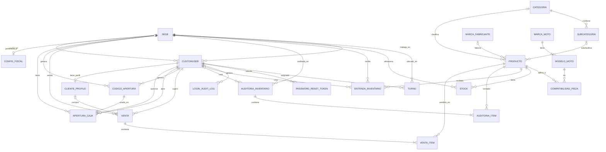
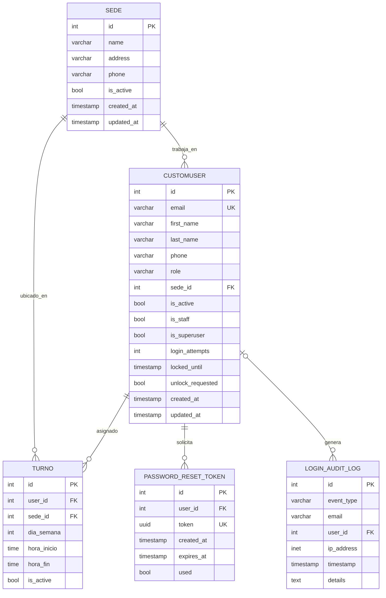
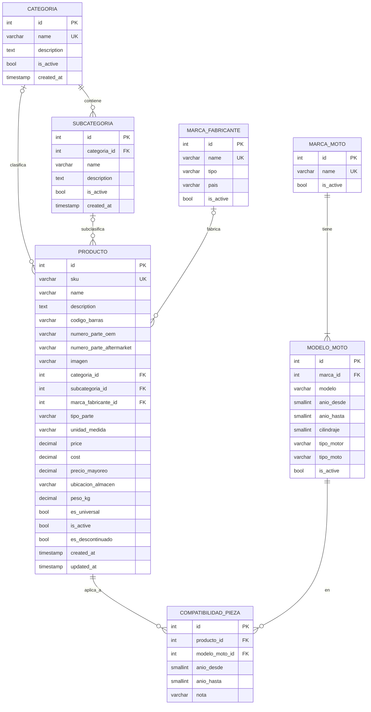
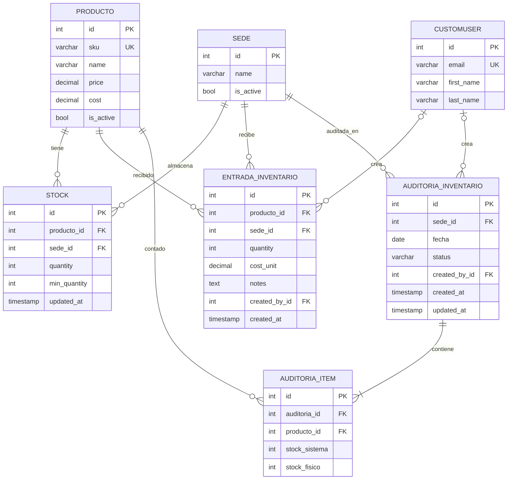
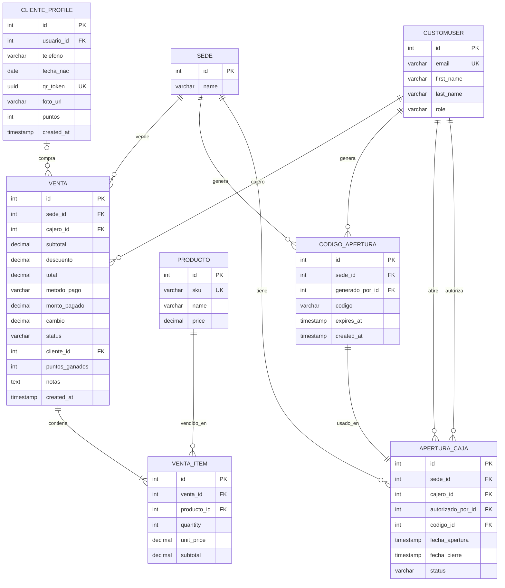
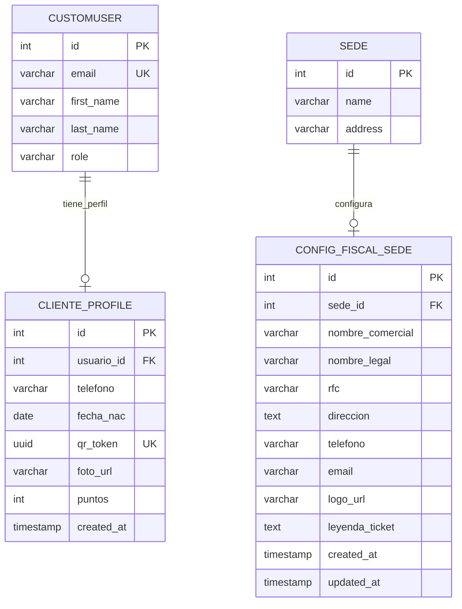

# MotoQFox — Diagramas de Base de Datos

> Generado: 2026-03-11
> Motor: PostgreSQL 16 · ORM: Django 5.0.1
> 6 apps · 22 tablas · 35+ relaciones

---

## Índice

1. [Resumen del esquema](#1-resumen-del-esquema)
2. [Diagrama ERD — Vista completa](#2-diagrama-erd--vista-completa)
3. [ERD por módulo](#3-erd-por-módulo)
   - 3.1 [Módulo: Users + Branches](#31-módulo-users--branches)
   - 3.2 [Módulo: Inventory — Catálogo](#32-módulo-inventory--catálogo)
   - 3.3 [Módulo: Inventory — Stock & Auditoría](#33-módulo-inventory--stock--auditoría)
   - 3.4 [Módulo: Sales (POS)](#34-módulo-sales-pos)
   - 3.5 [Módulo: Customers & Billing](#35-módulo-customers--billing)
4. [Referencia completa de tablas](#4-referencia-completa-de-tablas)
5. [Índices y restricciones](#5-índices-y-restricciones)
6. [Enumeraciones (Choices)](#6-enumeraciones-choices)

---

## 1. Resumen del esquema

| App Django | Tablas | Descripción |
|---|---|---|
| `branches` | 1 | Sedes físicas |
| `users` | 4 | Usuarios, turnos, tokens, auditoría de acceso |
| `inventory` | 11 | Catálogo YMM, productos, stock, auditorías |
| `sales` | 4 | Ventas POS, apertura de caja |
| `customers` | 1 | Perfil cliente con puntos y QR |
| `billing` | 1 | Configuración fiscal por sede |
| **Total** | **22** | |

### Mapa de dependencias entre apps

```
branches ←─── users
    ↑            ↑
    │            │
inventory ←── sales ←── customers
                 ↑
               billing → branches
```

---

## 2. Diagrama ERD — Vista completa

> Relaciones entre las 22 tablas. Sin detalle de campos para mejor legibilidad.



---

## 3. ERD por módulo

### 3.1 Módulo: Users + Branches



---

### 3.2 Módulo: Inventory — Catálogo



---

### 3.3 Módulo: Inventory — Stock & Auditoría



---

### 3.4 Módulo: Sales (POS)



---

### 3.5 Módulo: Customers & Billing



---

## 4. Referencia completa de tablas

### `branches_sedes` — Sede

| Campo | Tipo | Null | Unique | Default | Notas |
|---|---|---|---|---|---|
| `id` | integer | NO | PK | auto | |
| `name` | varchar(100) | NO | — | — | |
| `address` | varchar(255) | NO | — | — | |
| `phone` | varchar(20) | NO | — | `''` | |
| `is_active` | boolean | NO | — | `true` | Soft delete |
| `created_at` | timestamp tz | NO | — | auto | |
| `updated_at` | timestamp tz | NO | — | auto | |

---

### `users` — CustomUser

| Campo | Tipo | Null | Unique | Default | Notas |
|---|---|---|---|---|---|
| `id` | integer | NO | PK | auto | |
| `email` | varchar(255) | NO | UK + idx | — | USERNAME_FIELD |
| `first_name` | varchar(150) | NO | — | — | |
| `last_name` | varchar(150) | NO | — | — | |
| `phone` | varchar(20) | NO | — | `''` | |
| `role` | varchar(20) | NO | — | `CUSTOMER` | Enum: ver §6 |
| `sede_id` | integer | YES | — | NULL | FK → branches_sedes |
| `is_active` | boolean | NO | — | `true` | |
| `is_staff` | boolean | NO | — | `false` | |
| `is_superuser` | boolean | NO | — | `false` | |
| `password` | varchar(128) | NO | — | — | Hash bcrypt |
| `last_login` | timestamp tz | YES | — | NULL | Django built-in |
| `login_attempts` | integer | NO | — | `0` | Lockout counter |
| `locked_until` | timestamp tz | YES | — | NULL | |
| `unlock_requested` | boolean | NO | — | `false` | |
| `created_at` | timestamp tz | NO | — | now | |
| `updated_at` | timestamp tz | NO | — | auto | |

---

### `users_turnos` — Turno

| Campo | Tipo | Null | Unique | Default | Notas |
|---|---|---|---|---|---|
| `id` | integer | NO | PK | auto | |
| `user_id` | integer | NO | — | — | FK → users |
| `sede_id` | integer | NO | — | — | FK → branches_sedes |
| `dia_semana` | integer | NO | — | — | 0=Lun…6=Dom |
| `hora_inicio` | time | NO | — | — | |
| `hora_fin` | time | NO | — | — | |
| `is_active` | boolean | NO | — | `true` | |

> **unique_together**: (`user_id`, `dia_semana`)

---

### `users_password_reset_tokens` — PasswordResetToken

| Campo | Tipo | Null | Unique | Default | Notas |
|---|---|---|---|---|---|
| `id` | integer | NO | PK | auto | |
| `user_id` | integer | NO | — | — | FK → users |
| `token` | uuid | NO | UK | uuid4 | Single-use |
| `created_at` | timestamp tz | NO | — | auto | |
| `expires_at` | timestamp tz | NO | — | — | +1h de created_at |
| `used` | boolean | NO | — | `false` | |

---

### `users_login_audit_log` — LoginAuditLog

| Campo | Tipo | Null | Unique | Default | Notas |
|---|---|---|---|---|---|
| `id` | integer | NO | PK | auto | |
| `event_type` | varchar(30) | NO | — | — | Enum: ver §6 |
| `email` | varchar(254) | NO | — | — | Se guarda aunque no exista user |
| `user_id` | integer | YES | — | NULL | FK → users (SET_NULL) |
| `ip_address` | inet | YES | — | NULL | |
| `timestamp` | timestamp tz | NO | — | auto | |
| `details` | text | NO | — | `''` | |

---

### `inventory_categorias` — Categoria

| Campo | Tipo | Null | Unique | Default | Notas |
|---|---|---|---|---|---|
| `id` | integer | NO | PK | auto | |
| `name` | varchar(100) | NO | UK | — | |
| `description` | text | NO | — | `''` | |
| `is_active` | boolean | NO | — | `true` | |
| `created_at` | timestamp tz | NO | — | auto | |

---

### `inventory_subcategorias` — Subcategoria

| Campo | Tipo | Null | Unique | Default | Notas |
|---|---|---|---|---|---|
| `id` | integer | NO | PK | auto | |
| `categoria_id` | integer | NO | — | — | FK → inventory_categorias |
| `name` | varchar(100) | NO | — | — | |
| `description` | text | NO | — | `''` | |
| `is_active` | boolean | NO | — | `true` | |
| `created_at` | timestamp tz | NO | — | auto | |

> **unique_together**: (`categoria_id`, `name`)

---

### `inventory_marcas_fabricante` — MarcaFabricante

| Campo | Tipo | Null | Unique | Default | Notas |
|---|---|---|---|---|---|
| `id` | integer | NO | PK | auto | |
| `name` | varchar(100) | NO | UK | — | |
| `tipo` | varchar(20) | NO | — | `AFTERMARKET` | Enum: ver §6 |
| `pais` | varchar(50) | NO | — | `''` | |
| `is_active` | boolean | NO | — | `true` | |

---

### `inventory_marcas_moto` — MarcaMoto

| Campo | Tipo | Null | Unique | Default | Notas |
|---|---|---|---|---|---|
| `id` | integer | NO | PK | auto | |
| `name` | varchar(80) | NO | UK | — | |
| `is_active` | boolean | NO | — | `true` | |

---

### `inventory_modelos_moto` — ModeloMoto

| Campo | Tipo | Null | Unique | Default | Notas |
|---|---|---|---|---|---|
| `id` | integer | NO | PK | auto | |
| `marca_id` | integer | NO | — | — | FK → inventory_marcas_moto |
| `modelo` | varchar(100) | NO | — | — | |
| `año_desde` | smallint | NO | — | `2018` | |
| `año_hasta` | smallint | YES | — | NULL | |
| `cilindraje` | smallint | YES | — | NULL | cc |
| `tipo_motor` | varchar(10) | NO | — | `4T` | Enum: ver §6 |
| `tipo_moto` | varchar(20) | NO | — | `CARGO` | Enum: ver §6 |
| `is_active` | boolean | NO | — | `true` | |

> **unique_together**: (`marca_id`, `modelo`, `año_desde`)

---

### `inventory_productos` — Producto

| Campo | Tipo | Null | Unique | Default | Notas |
|---|---|---|---|---|---|
| `id` | integer | NO | PK | auto | |
| `sku` | varchar(50) | NO | UK | — | |
| `name` | varchar(200) | NO | — | — | |
| `description` | text | NO | — | `''` | |
| `codigo_barras` | varchar(50) | NO | — | `''` | idx; auto desde SKU |
| `numero_parte_oem` | varchar(80) | NO | — | `''` | |
| `numero_parte_aftermarket` | varchar(80) | NO | — | `''` | |
| `imagen` | varchar(100) | YES | — | NULL | Ruta: `products/` |
| `categoria_id` | integer | YES | — | NULL | FK → inventory_categorias |
| `subcategoria_id` | integer | YES | — | NULL | FK → inventory_subcategorias |
| `marca_fabricante_id` | integer | YES | — | NULL | FK → inventory_marcas_fabricante |
| `tipo_parte` | varchar(20) | NO | — | `AFTERMARKET` | Enum: ver §6 |
| `unidad_medida` | varchar(10) | NO | — | `PIEZA` | Enum: ver §6 |
| `price` | decimal(10,2) | NO | — | — | IVA incluido |
| `cost` | decimal(10,2) | NO | — | — | |
| `precio_mayoreo` | decimal(10,2) | YES | — | NULL | |
| `ubicacion_almacen` | varchar(30) | NO | — | `''` | Ej: A-03-2-B |
| `peso_kg` | decimal(6,3) | YES | — | NULL | |
| `es_universal` | boolean | NO | — | `false` | |
| `is_active` | boolean | NO | — | `true` | Soft delete |
| `es_descontinuado` | boolean | NO | — | `false` | |
| `created_at` | timestamp tz | NO | — | auto | |
| `updated_at` | timestamp tz | NO | — | auto | |

---

### `inventory_compatibilidad_pieza` — CompatibilidadPieza *(Through M2M)*

| Campo | Tipo | Null | Unique | Default | Notas |
|---|---|---|---|---|---|
| `id` | integer | NO | PK | auto | |
| `producto_id` | integer | NO | — | — | FK → inventory_productos |
| `modelo_moto_id` | integer | NO | — | — | FK → inventory_modelos_moto |
| `año_desde` | smallint | YES | — | NULL | Override del modelo |
| `año_hasta` | smallint | YES | — | NULL | Override del modelo |
| `nota` | varchar(200) | NO | — | `''` | |

> **unique_together**: (`producto_id`, `modelo_moto_id`)

---

### `inventory_stock` — Stock

| Campo | Tipo | Null | Unique | Default | Notas |
|---|---|---|---|---|---|
| `id` | integer | NO | PK | auto | |
| `producto_id` | integer | NO | — | — | FK → inventory_productos |
| `sede_id` | integer | NO | — | — | FK → branches_sedes |
| `quantity` | integer | NO | — | `0` | |
| `min_quantity` | integer | NO | — | `5` | Umbral alerta |
| `updated_at` | timestamp tz | NO | — | auto | |

> **unique_together**: (`producto_id`, `sede_id`)

---

### `inventory_entradas` — EntradaInventario

| Campo | Tipo | Null | Unique | Default | Notas |
|---|---|---|---|---|---|
| `id` | integer | NO | PK | auto | |
| `producto_id` | integer | NO | — | — | FK → inventory_productos (PROTECT) |
| `sede_id` | integer | NO | — | — | FK → branches_sedes (PROTECT) |
| `quantity` | integer | NO | — | — | Incrementa Stock.quantity |
| `cost_unit` | decimal(10,2) | NO | — | — | |
| `notes` | text | NO | — | `''` | |
| `created_by_id` | integer | YES | — | NULL | FK → users (SET_NULL) |
| `created_at` | timestamp tz | NO | — | auto | |

---

### `inventory_auditorias` — AuditoriaInventario

| Campo | Tipo | Null | Unique | Default | Notas |
|---|---|---|---|---|---|
| `id` | integer | NO | PK | auto | |
| `sede_id` | integer | NO | — | — | FK → branches_sedes (PROTECT) |
| `fecha` | date | NO | — | — | |
| `status` | varchar(20) | NO | — | `DRAFT` | Enum: `DRAFT`, `FINALIZADA` |
| `created_by_id` | integer | YES | — | NULL | FK → users (SET_NULL) |
| `created_at` | timestamp tz | NO | — | auto | |
| `updated_at` | timestamp tz | NO | — | auto | |

---

### `inventory_auditoria_items` — AuditoriaItem

| Campo | Tipo | Null | Unique | Default | Notas |
|---|---|---|---|---|---|
| `id` | integer | NO | PK | auto | |
| `auditoria_id` | integer | NO | — | — | FK → inventory_auditorias |
| `producto_id` | integer | NO | — | — | FK → inventory_productos (PROTECT) |
| `stock_sistema` | integer | NO | — | — | Snapshot al crear |
| `stock_fisico` | integer | YES | — | NULL | Null = no contado aún |

> **unique_together**: (`auditoria_id`, `producto_id`)

---

### `sales_ventas` — Venta

| Campo | Tipo | Null | Unique | Default | Notas |
|---|---|---|---|---|---|
| `id` | integer | NO | PK | auto | |
| `sede_id` | integer | NO | — | — | FK → branches_sedes (PROTECT) |
| `cajero_id` | integer | NO | — | — | FK → users (PROTECT) |
| `subtotal` | decimal(10,2) | NO | — | — | Suma de items |
| `descuento` | decimal(10,2) | NO | — | `0` | |
| `total` | decimal(10,2) | NO | — | — | IVA incluido |
| `metodo_pago` | varchar(20) | NO | — | `EFECTIVO` | Enum: ver §6 |
| `monto_pagado` | decimal(10,2) | NO | — | `0` | |
| `cambio` | decimal(10,2) | NO | — | `0` | |
| `status` | varchar(20) | NO | — | `COMPLETADA` | Enum: ver §6 |
| `cliente_id` | integer | YES | — | NULL | FK → customers_perfiles (SET_NULL) |
| `puntos_ganados` | integer | NO | — | `0` | |
| `notas` | text | NO | — | `''` | |
| `created_at` | timestamp tz | NO | — | auto | |

---

### `sales_venta_items` — VentaItem

| Campo | Tipo | Null | Unique | Default | Notas |
|---|---|---|---|---|---|
| `id` | integer | NO | PK | auto | |
| `venta_id` | integer | NO | — | — | FK → sales_ventas (CASCADE) |
| `producto_id` | integer | NO | — | — | FK → inventory_productos (PROTECT) |
| `quantity` | integer | NO | — | — | Positivo |
| `unit_price` | decimal(10,2) | NO | — | — | Precio al momento de venta |
| `subtotal` | decimal(10,2) | NO | — | — | quantity × unit_price |

---

### `sales_codigos_apertura` — CodigoApertura

| Campo | Tipo | Null | Unique | Default | Notas |
|---|---|---|---|---|---|
| `id` | integer | NO | PK | auto | |
| `sede_id` | integer | NO | — | — | FK → branches_sedes (PROTECT) |
| `generado_por_id` | integer | NO | — | — | FK → users (PROTECT) |
| `codigo` | varchar(6) | NO | — | — | 6 dígitos, expira en 30 min |
| `expires_at` | timestamp tz | NO | — | — | |
| `created_at` | timestamp tz | NO | — | auto | |

---

### `sales_aperturas_caja` — AperturaCaja

| Campo | Tipo | Null | Unique | Default | Notas |
|---|---|---|---|---|---|
| `id` | integer | NO | PK | auto | |
| `sede_id` | integer | NO | — | — | FK → branches_sedes (PROTECT) |
| `cajero_id` | integer | NO | — | — | FK → users (PROTECT) |
| `autorizado_por_id` | integer | NO | — | — | FK → users (PROTECT) |
| `codigo_id` | integer | NO | — | — | FK → sales_codigos_apertura (PROTECT) |
| `fecha_apertura` | timestamp tz | NO | — | auto | |
| `fecha_cierre` | timestamp tz | YES | — | NULL | |
| `status` | varchar(10) | NO | — | `ABIERTA` | Enum: `ABIERTA`, `CERRADA` |

> **UniqueConstraint**: `cajero_id` WHERE `status = 'ABIERTA'` → un cajero no puede tener dos cajas abiertas

---

### `customers_perfiles` — ClienteProfile

| Campo | Tipo | Null | Unique | Default | Notas |
|---|---|---|---|---|---|
| `id` | integer | NO | PK | auto | |
| `usuario_id` | integer | NO | UK | — | OneToOne → users (PROTECT) |
| `telefono` | varchar(20) | NO | — | `''` | |
| `fecha_nac` | date | YES | — | NULL | |
| `qr_token` | uuid | NO | UK | uuid4 | Para QR en punto de venta |
| `foto_url` | varchar(500) | NO | — | `''` | |
| `puntos` | integer | NO | — | `0` | Programa de lealtad |
| `created_at` | timestamp tz | NO | — | auto | |

---

### `billing_config_fiscal_sede` — ConfiguracionFiscalSede

| Campo | Tipo | Null | Unique | Default | Notas |
|---|---|---|---|---|---|
| `id` | integer | NO | PK | auto | |
| `sede_id` | integer | NO | UK | — | OneToOne → branches_sedes (PROTECT) |
| `nombre_comercial` | varchar(200) | NO | — | — | En ticket impreso |
| `nombre_legal` | varchar(300) | NO | — | `''` | |
| `rfc` | varchar(13) | NO | — | `''` | |
| `direccion` | text | NO | — | `''` | |
| `telefono` | varchar(30) | NO | — | `''` | |
| `email` | varchar(254) | NO | — | `''` | |
| `logo_url` | varchar(500) | NO | — | `''` | |
| `leyenda_ticket` | text | NO | — | ver nota | |
| `created_at` | timestamp tz | NO | — | auto | |
| `updated_at` | timestamp tz | NO | — | auto | |

---

## 5. Índices y restricciones

| Tabla | Constraint | Campos | Tipo |
|---|---|---|---|
| `users` | PK | `id` | Primary Key |
| `users` | UK+idx | `email` | Unique + db_index |
| `users_turnos` | UQ | `(user_id, dia_semana)` | unique_together |
| `users_password_reset_tokens` | UK | `token` | Unique |
| `inventory_categorias` | UK | `name` | Unique |
| `inventory_subcategorias` | UQ | `(categoria_id, name)` | unique_together |
| `inventory_marcas_fabricante` | UK | `name` | Unique |
| `inventory_marcas_moto` | UK | `name` | Unique |
| `inventory_modelos_moto` | UQ | `(marca_id, modelo, año_desde)` | unique_together |
| `inventory_productos` | UK | `sku` | Unique |
| `inventory_productos` | idx | `codigo_barras` | db_index |
| `inventory_compatibilidad_pieza` | UQ | `(producto_id, modelo_moto_id)` | unique_together |
| `inventory_stock` | UQ | `(producto_id, sede_id)` | unique_together |
| `inventory_auditoria_items` | UQ | `(auditoria_id, producto_id)` | unique_together |
| `customers_perfiles` | UK | `usuario_id` | OneToOne |
| `customers_perfiles` | UK | `qr_token` | Unique |
| `billing_config_fiscal_sede` | UK | `sede_id` | OneToOne |
| `sales_aperturas_caja` | Partial UQ | `cajero_id WHERE status='ABIERTA'` | UniqueConstraint |

---

## 6. Enumeraciones (Choices)

### CustomUser.role
| Valor | Etiqueta |
|---|---|
| `ADMINISTRATOR` | Administrador |
| `ENCARGADO` | Encargado de Sede |
| `WORKER` | Trabajador |
| `CASHIER` | Cajero |
| `CUSTOMER` | Cliente |

### Turno.dia_semana
| Valor | Etiqueta |
|---|---|
| `0` | Lunes |
| `1` | Martes |
| `2` | Miércoles |
| `3` | Jueves |
| `4` | Viernes |
| `5` | Sábado |
| `6` | Domingo |

### LoginAuditLog.event_type
| Valor | Etiqueta |
|---|---|
| `LOGIN_SUCCESS` | Inicio de sesión exitoso |
| `LOGIN_FAILED` | Intento fallido |
| `ACCOUNT_LOCKED` | Cuenta bloqueada |
| `ACCOUNT_UNLOCKED` | Cuenta desbloqueada |
| `UNLOCK_REQUESTED` | Solicitud de desbloqueo |
| `PASSWORD_RESET_REQ` | Solicitud de restablecimiento |
| `PASSWORD_RESET_DONE` | Contraseña restablecida |

### MarcaFabricante.tipo
| Valor | Etiqueta |
|---|---|
| `OEM` | OEM (Original Equipment Manufacturer) |
| `AFTERMARKET` | Aftermarket |
| `GENERICO` | Genérico |

### ModeloMoto.tipo_motor
| Valor | Etiqueta |
|---|---|
| `2T` | 2 Tiempos |
| `4T` | 4 Tiempos |
| `ELECTRICO` | Eléctrico |

### ModeloMoto.tipo_moto
| Valor | Etiqueta |
|---|---|
| `CARGO` | Carga / Trabajo |
| `NAKED` | Naked / Urbana |
| `DEPORTIVA` | Deportiva |
| `SCOOTER` | Scooter / Automática |
| `OFF_ROAD` | Off Road / Enduro |
| `CRUCERO` | Crucero |

### Producto.tipo_parte
| Valor | Etiqueta |
|---|---|
| `OEM` | OEM (Original) |
| `AFTERMARKET` | Aftermarket |
| `REMANUFACTURADO` | Remanufacturado |

### Producto.unidad_medida
| Valor | Etiqueta |
|---|---|
| `PIEZA` | Pieza |
| `PAR` | Par |
| `KIT` | Kit |
| `LITRO` | Litro |
| `METRO` | Metro |
| `ROLLO` | Rollo |

### Venta.metodo_pago
| Valor | Etiqueta |
|---|---|
| `EFECTIVO` | Efectivo |
| `TARJETA` | Tarjeta |
| `TRANSFERENCIA` | Transferencia |

### Venta.status / AperturaCaja.status
| Valor | Etiqueta |
|---|---|
| `COMPLETADA` | Completada |
| `CANCELADA` | Cancelada |
| `ABIERTA` | Abierta |
| `CERRADA` | Cerrada |

### AuditoriaInventario.status
| Valor | Etiqueta |
|---|---|
| `DRAFT` | Borrador |
| `FINALIZADA` | Finalizada |

---

*Documento generado automáticamente desde los modelos Django del proyecto MotoQFox.*
